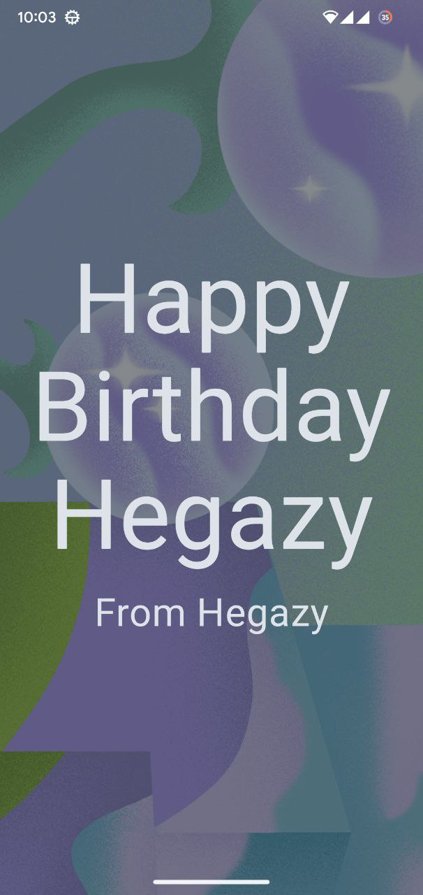

# 🎂 Happy Birthday App

A simple Android app from the Google Android Basics with Compose course.  
It displays a birthday greeting message with styled text.

---

## What I Learned
- Creating and customizing text with `Text()`.
- Applying text styles like font size, color, and alignment.
- Using `@Preview` for UI previews.
- Structuring basic composable functions.

---

## Technologies Used
- **Kotlin**
- **Jetpack Compose**
- **Material 3**

---

## Screenshot

---

This is part of my Android learning journey.
